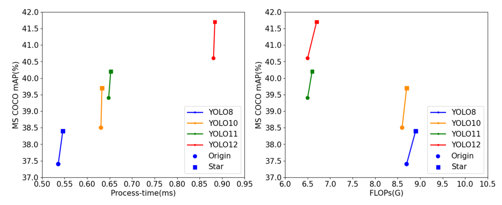

<h1>YOLO-Star</h1>
<h3>YOLO-Star: Multi-Scale Feature Fusion via Element-wise Multiplication</h3>

    
  Comparison with previous YOLO models in terms of process-time (left) and FLOPs-accuracy (right) trade-offs

## Experiment Result
All Experiment is processed with RTX 4090 1-way

### Comparison with previous models
<table>
  <thead>
    <tr>
      <th style="text-align:center;">Model</th>
      <th style="text-align:center;">mAPval 50-95</th>
      <th style="text-align:center;">Time (ms) TensorRT(FP16)</th>
      <th style="text-align:center;">Params (M)</th>
      <th style="text-align:center;">FLOPs (G)</th>
    </tr>
  </thead>
  <tbody>
    <tr>
      <td style="text-align:center;"><b>YOLO8n</b></td>
      <td style="text-align:center;">37.4</td>
      <td style="text-align:center;">0.5359</td>
      <td style="text-align:center;">3.152</td>
      <td style="text-align:center;">8.7</td>
    </tr>
    <tr>
      <th style="text-align:center;"><b>YOLO8n-Star</b></th>
      <th style="text-align:center;">38.4</th>
      <th style="text-align:center;">0.5460</th>
      <th style="text-align:center;">3.173</th>
      <th style="text-align:center;">8.9</th>
    </tr>
    <tr>
      <td style="text-align:center;"><b>YOLO10n</b></td>
      <td style="text-align:center;">38.5</td>
      <td style="text-align:center;">0.6308</td>
      <td style="text-align:center;">2.763</td>
      <td style="text-align:center;">8.6</td>
    </tr>
    <tr>
      <th style="text-align:center;"><b>YOLO10n-Star</b></th>
      <th style="text-align:center;">39.7</th>
      <th style="text-align:center;">0.6330</th>
      <th style="text-align:center;">2.784</th>
      <th style="text-align:center;">8.7</th>
    </tr>
    <tr>
      <td style="text-align:center;"><b>YOLO11n</b></td>
      <td style="text-align:center;">39.4</td>
      <td style="text-align:center;">0.6480</td>
      <td style="text-align:center;">2.642</td>
      <td style="text-align:center;">6.5</td>
    </tr>
    <tr>
      <th style="text-align:center;"><b>YOLO11n-Star</b></th>
      <th style="text-align:center;">40.2</th>
      <th style="text-align:center;">0.6525</th>
      <th style="text-align:center;">2.642</th>
      <th style="text-align:center;">6.6</th>
    </tr>
    <tr>
      <td style="text-align:center;"><b>YOLO12n</b></td>
      <td style="text-align:center;">40.6</td>
      <td style="text-align:center;">0.8809</td>
      <td style="text-align:center;">2.590</td>
      <td style="text-align:center;">6.5</td>
    </tr>
    <tr>
      <th style="text-align:center;"><b>YOLO12n-Star</b></th>
      <th style="text-align:center;">41.7</th>
      <th style="text-align:center;">0.8839</th>
      <th style="text-align:center;">2.633</th>
      <th style="text-align:center;">6.7</th>
    </tr>
  </tbody>
</table>